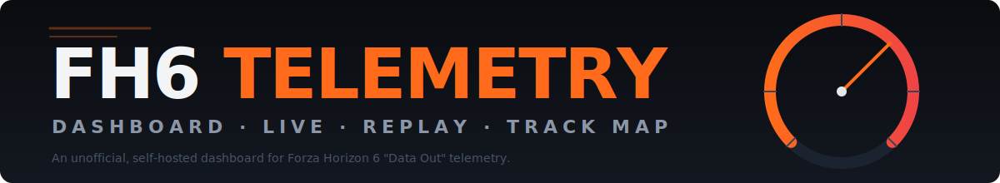
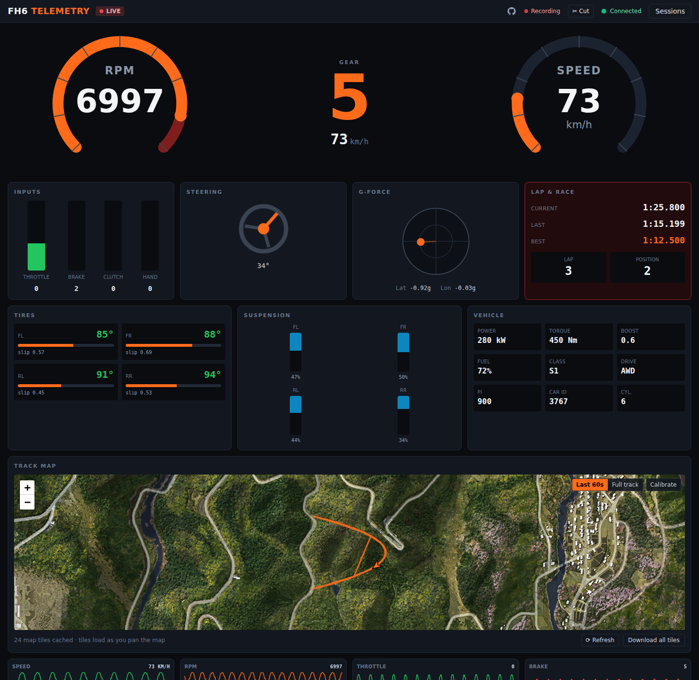
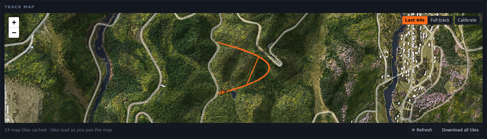
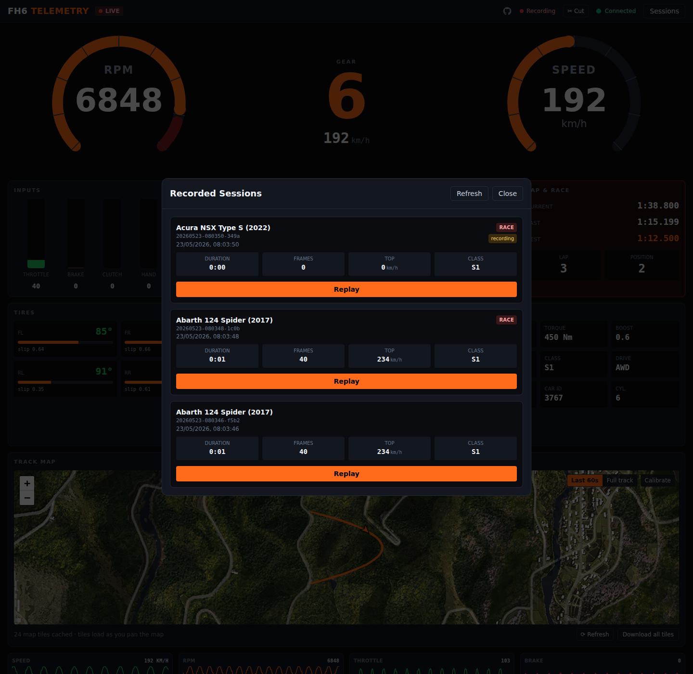

<p align="center">
  
</p>

# Forza Horizon 6 Telemetry Dashboard

A self-hosted, Dockerized dashboard for **Forza Horizon 6**. It receives the
game's "Data Out" UDP telemetry, shows it live in a racing-cockpit web
dashboard, records every driving session to disk, and replays recorded
sessions in the same dashboard.

> _This project is not affiliated with Microsoft, Playground Games or any
> entity behind the Forza franchise. See the [Disclaimer](#disclaimer) below._

```
Forza Horizon 6  ──UDP──▶  Container  ──▶  Live dashboard (WebSocket)
                                │
                                └──▶  Recorded sessions on /data  ──▶  Replay
```

## Features

- **Live telemetry** — speed, RPM, gear, pedals, steering, G-force, tyres,
  suspension, lap/race data, vehicle stats, and rolling charts.
- **Track map** — racing line and heading-aware car marker on a Leaflet map.
  Map tiles are cached lazily as you view the map; a tile-less vector trace is
  shown wherever tiles are unavailable.
- **Automatic recording** — every session is written to `/data/sessions` as
  JSON Lines, with a manifest and computed statistics.
- **Replay** — browse recorded sessions and replay them in the dashboard with
  pause/resume/stop, `0.25x`–`8x` speed, and seek.
- **Single container** — one image serves the dashboard, the API, the
  WebSocket feed and the UDP receiver.

## Screenshots

|                                                           |                                                               |
| --------------------------------------------------------- | ------------------------------------------------------------- |
|  |  |
| Live cockpit dashboard                                    | Track map with racing line                                    |



_Recorded sessions browser — race sessions carry a **RACE** pill and car ordinals resolve to make / model via the bundled FM23 dataset._

## Quick start

The published image is on Docker Hub as
[`acaranta/fh6-telemetry-dashboard`](https://hub.docker.com/r/acaranta/fh6-telemetry-dashboard).
The compose file in this repo pulls it directly:

```bash
docker compose up -d
```

Then open the dashboard (default <http://localhost:8131>; adjust ports/env in
`docker-compose.yml` to taste).

Recorded sessions are stored in `./fh6-data` on the host (mounted at `/data`).

### Build from source

If you want to build the dashboard locally from this repository instead of
pulling the published image, use the dev compose file:

```bash
docker compose -f docker-compose.dev.yml up --build
```

## Configure Forza Horizon 6

In the game: **Settings → HUD and Gameplay → Data Out**

| Setting       | Value                                            |
| ------------- | ------------------------------------------------ |
| Data Out      | `On`                                             |
| Data Out IP   | the IP address of the host running the container |
| Data Out Port | `20440`                                          |

The container listens on UDP port **20440** by default. If the game runs on the
same machine as Docker, use that machine's LAN IP (not `127.0.0.1`, since the
container is a separate network namespace) — or run the game on a console/PC and
point it at the Docker host.

Start driving; the dashboard updates in real time and a recording begins
automatically.

## Recordings

Each session is a folder under `/data/sessions`:

```
/data/sessions/20260522-183012-a1b2/
├── manifest.json     session metadata, car info and stats
├── telemetry.jsonl   one normalized telemetry frame per line
└── stats.json        computed session statistics
```

A session **starts** on the first in-race telemetry frame and **ends** after
`SESSION_TIMEOUT_SECONDS` without packets. If the container is stopped
mid-session, the session is repaired (marked `recovered`) on the next start.

Set `COMPRESS_FINISHED_SESSIONS=true` to gzip `telemetry.jsonl` when a session
finishes.

## Replay

Open **Sessions** in the top bar, pick a session and press **Replay**. The
dashboard switches to replay mode with transport controls, a speed selector and
a seek bar. Press **Stop** to return to live mode.

## Configuration

All settings are environment variables — set them in `docker-compose.yml` (or pass to `docker run`):

| Variable                     | Default   | Description                                        |
| ---------------------------- | --------- | -------------------------------------------------- |
| `WEB_PORT`                   | `8080`    | Dashboard HTTP/WebSocket port                      |
| `UDP_HOST`                   | `0.0.0.0` | UDP bind address                                   |
| `UDP_PORT`                   | `20440`   | UDP telemetry port                                 |
| `DATA_DIR`                   | `/data`   | Storage root for sessions, tiles and settings      |
| `SESSION_TIMEOUT_SECONDS`    | `30`      | Packet silence before a session ends               |
| `COMPRESS_FINISHED_SESSIONS` | `false`   | gzip `telemetry.jsonl` on session end              |
| `ALLOW_DELETE_SESSIONS`      | `false`   | Enable `DELETE /api/sessions/:id`                  |
| `LOCK_TO_FIRST_SENDER`       | `false`   | Ignore packets from other source IPs               |
| `LOG_LEVEL`                  | `info`    | `trace`/`debug`/`info`/`warn`/`error`/`silent`     |
| `BROADCAST_HZ`               | `30`      | Live WebSocket rate (recording stays at full rate) |
| `MAP_ENABLED`                | `true`    | Enable the track map                               |
| `MAP_AUTODOWNLOAD_TILES`     | `false`   | Bulk pre-download all tiles on startup             |
| `MAP_TILES_URL`              | MapGenie  | Tile URL template (`{z}/{x}/{y}`)                  |
| `MAX_SESSION_LIST_ITEMS`     | `500`     | Max sessions returned by the API                   |

## API

| Method   | Path                     | Description                                      |
| -------- | ------------------------ | ------------------------------------------------ |
| `GET`    | `/api/health`            | Health check                                     |
| `GET`    | `/api/status`            | Runtime status (UDP, recording, map)             |
| `GET`    | `/api/sessions`          | List recorded sessions                           |
| `GET`    | `/api/sessions/:id`      | Session manifest                                 |
| `DELETE` | `/api/sessions/:id`      | Delete a session (needs `ALLOW_DELETE_SESSIONS`) |
| `GET`    | `/api/settings`          | Map calibration settings                         |
| `PUT`    | `/api/settings`          | Update map calibration                           |
| `GET`    | `/maptiles/:z/:x/:y`     | Map tile (cached lazily from upstream)           |
| `POST`   | `/api/maptiles/download` | Bulk-download all map tiles                      |
| `POST`   | `/api/maptiles/refresh`  | Forget failed tiles so missing ones retry        |
| `WS`     | `/ws`                    | Live telemetry + replay control                  |

## Development

Requires Node.js 20+.

```bash
npm install
npm run dev        # server (:8080) + Vite dev server (:5173)
npm test           # run the test suite
npm run lint       # ESLint + Prettier
npm run typecheck  # tsc --noEmit
npm run build      # production build into dist/
```

Useful tools:

```bash
npm run capture         # capture one raw FH6 packet for offset verification
npm run download-tiles  # pre-download the map tiles
```

## Notes & caveats

- **Packet offsets are unverified.** The FH6 "Car Dash" packet layout in
  [`src/server/telemetry/offsets.ts`](src/server/telemetry/offsets.ts) is
  assembled from the official documentation plus FH5 / Forza Motorsport
  community sources, and is partly inferred. The parser is length-tolerant.
  Run `npm run capture` against a real game to verify and correct the offsets.
- **Map tiles** are fetched from MapGenie and cached into your `/data` volume
  on demand — each tile is downloaded the first time the map shows it.
  Downloads are size-checked and retried; a corrupt/too-small response is never
  cached, and a tile that keeps failing is retried automatically when you
  return to that area or via the **⟳ Refresh** button. Use the **Download all
  tiles** button (or `MAP_AUTODOWNLOAD_TILES=true`) to pre-cache the whole map
  for offline use. Tiles are not bundled in the image; they are extracted game
  assets, so use of the map feature is at the operator's discretion. The track
  map falls back to a tile-less vector trace when tiles are unavailable.

## Credits & references

This project would not exist without prior community work on Forza telemetry
and on the Forza Horizon 6 map. Inspiration and concrete reference material:

- **[TheBanHammer/fh6-tel](https://github.com/TheBanHammer/fh6-tel)** — a
  Rust + Tauri + Svelte desktop dashboard for FH6 (MIT). Reference for the
  Leaflet `CRS.Simple` setup with the `(1,0,1,0)` transformation, the
  `{z}/{y}/{x}` MapGenie URL convention, the calibration math, and the
  general session-recording approach.
- **[AmiralPatate/FM23Data](https://github.com/AmiralPatate/FM23Data)** —
  Forza Motorsport (2023) `modelexport.csv`, used to map `carOrdinal` to
  make/model/year in the session list. Best-effort coverage for FH6 — unknown
  ordinals fall back to `Car #N`. Regenerate via `npm run update-cars`.
- **[MapGenie — Forza Horizon 6](https://mapgenie.io/forza-horizon-6)** —
  source of the map tiles served lazily by the in-app tile proxy. Tiles are
  extracted game assets; the app downloads them on demand into your `/data`
  volume and never redistributes them.
- **Forza "Data Out" documentation:**
  - [Forza Horizon 6 Data Out](https://support.forza.net/hc/en-us/articles/51744149102611-Forza-Horizon-6-Data-Out-Documentation)
  - [Forza Motorsport Data Out](https://support.forzamotorsport.net/hc/en-us/articles/21742934024211-Forza-Motorsport-Data-Out-Documentation)
  - [Forza forums — UDP telemetry packet details](https://forums.forza.net/t/udp-telemetry-packet-details/629111)
  - [Forza forums — FH5 Data Out variables and structure](https://forums.forza.net/t/data-out-telemetry-variables-and-structure/535984)
- **Other Forza telemetry parsers (cross-checked while assembling the packet
  offset table):**
  - [grimsi/ForzaTelemetryReader](https://github.com/grimsi/ForzaTelemetryReader)
  - [richstokes/Forza-data-tools](https://github.com/richstokes/Forza-data-tools)
  - [nettrom/forza_motorsport](https://github.com/nettrom/forza_motorsport)
  - [fabiomix/forza-horizon-telemetry](https://github.com/fabiomix/forza-horizon-telemetry)
  - [csutorasa/go-forza-telemetry](https://pkg.go.dev/github.com/csutorasa/go-forza-telemetry)

## Disclaimer

This project is an **unofficial, fan-made** tool. It is **not affiliated with,
endorsed by, or sponsored by** Microsoft, Xbox Game Studios, Playground Games,
Turn 10 Studios, or any other entity behind the Forza franchise. _Forza_ and
_Forza Horizon_ are trademarks of Microsoft Corporation; all other trademarks
referenced here are the property of their respective owners.

The dashboard only consumes Forza's publicly documented "Data Out" UDP
telemetry feed — no game files are modified or redistributed. Map tile
rendering is best-effort against community-maintained tile servers; see
[Notes & caveats](#notes--caveats) for the operator's responsibility around
those tiles.

## License

MIT
